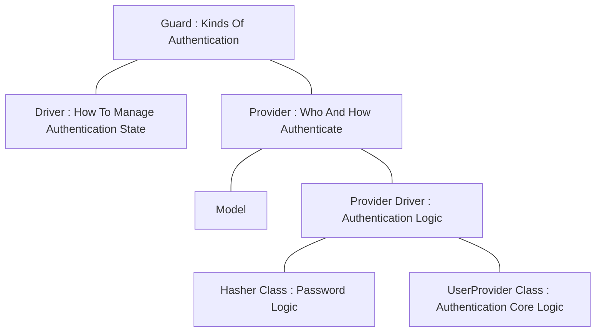

## Version
- 

## Authentication
This means `認証`.

## Authentication Role Diagram


## Guard
```php
// config/auth.php

'guards' => [
    'web' => [
        'driver' => 'session',
        'provider' => 'users',
    ],
],
```

## Provider
```php
// config/auth.php

'providers' => [
    'users' => [
        'driver' => 'eloquent',
        'model' => App\Models\User::class,
    ],
],
```


## Reference
- [Laravel readouble : Laravel 8.x Authentication](https://readouble.com/laravel/8.x/en/authentication.html)
- [Zenn : [図解] Laravel の認証周りのややこしいあれこれ。](https://zenn.dev/ad5/articles/48671b32c89897)
