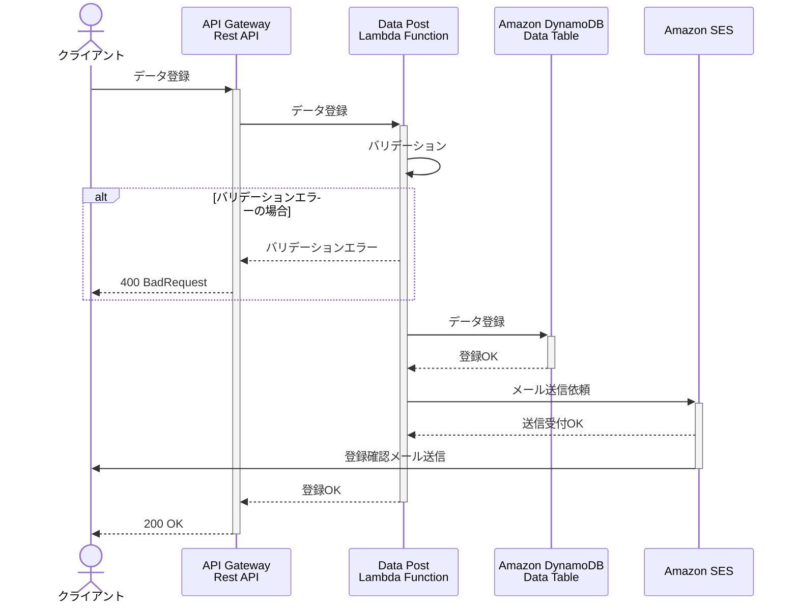

## Version
- 

## Markdown Preview Mermaid Support Extension
1. Install the extension.
2. Make markdown file.
3. Write code block with mermaid syntax.

## Sample
This is sample code from the below reference.

## Reference
- [mermaid-js docs : Diagram Syntax](https://mermaid-js.github.io/mermaid/#/n00b-syntaxReference)
- [Developers IO : よくあるAWSサーバーレス構成のシーケンス図をMarkdown（Mermaid）で描いてみた](https://dev.classmethod.jp/articles/drawing-a-sequence-diagram-of-a-common-aws-serverless-configuration-with-mermaid/)
